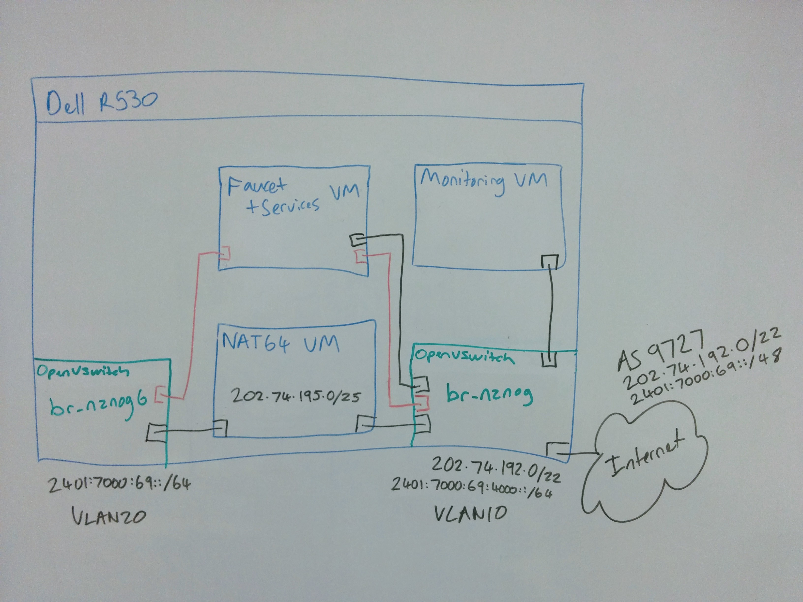
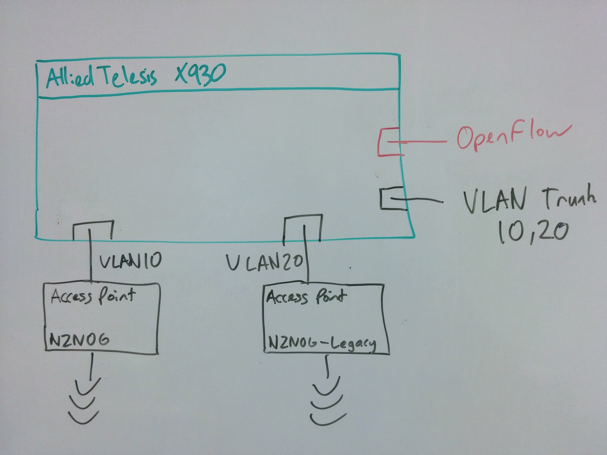

### Architecture




This git repo contains a network-in-a-box suitable for running tech conferences,
but would easily extend to running any sort fixed network such as a enterprise LAN.

We use the following software:
 * Userspace OpenvSwitch virtual switch with DPDK
 * Faucet SDN controller
 * Bird BGP routing daemon
 * Unbound DNS resolver
 * ISC DHCP server
 * jool NAT64 kernel module
 * Libvirt + QEMU/KVM virtualization

Which runs on the following hardware:
 * Dell PowerEdge R530
 * Intel 1 gig I350 quad port NICs
 * Intel 10 gig X520 dual port NICs
 * Allied Telesis X930 OpenFlow switches

We end up with two VLANs which can be broadcast on different wireless SSIDs or
physical network ports.

 * VLAN 10 is an IPv6-only network with DNS64/NAT64 for talking to legacy IPv4 networks
 * VLAN 20 is a mixed IPv4 and IPv6 network

We accomplish this by having two OpenvSwitch bridges (br-nznog and br-nznog6)
for our two networks that are controlled by faucet via OpenFlow.

 * The br-nznog bridge will contain the FIB for routing to our upstream provider.
   The FIB is installed by faucet and calculated by bird from any routes it
   receives via BGP from the upstream network. The br-nznog network is exposed as
   VLAN 20 on a tagged port on a physical DPDK interface to our OpenFlow switches.

 * The br-nznog6 bridge is a separate layer 2 IPv6-only network and we use a VM
   connected to both our bridges and linux routing to join the two networks. Jool
   provides NAT64 translation so that our IPv6-only clients can speak to IPv4
   networks. The br-nznog6 network is exposed as VLAN 10 on a tagged port on a
   physical DPDK interface to our OpenFlow switches.

### Network setup

The network can be easily deployed with ansible which will automatically install
and configure all required software.

You can find instructions on our [ansible repo](https://github.com/wandsdn/nznog-ansible).

### Debugging

Here are some useful debugging commands:

```bash
sudo ovs-ofctl -OOpenFlow13 dump-ports [bridge]
sudo ovs-ofctl -OOpenFlow13 dump-ports-desc [bridge]
sudo ovs-ofctl -OOpenFlow13 dump-flows [bridge]
sudo ovs-ofctl -OOpenFlow13 show [bridge]
sudo ovs-appctl dpif-netdev/pmd-stats-show
```
